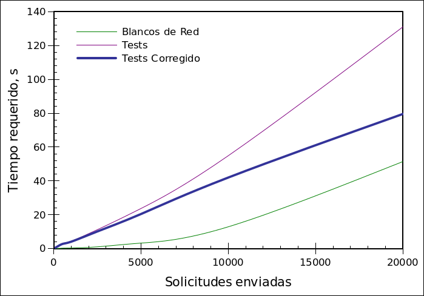

# Aranda Restful #
## Prueba técnica ##

Este repositorio corresponde a una prueba técnica para Aranda Software.

Implementa un árbol binario con una búsqueda de ancestro común más cercano que se basa en recorrer con DFS y, copiando la pila de trabajo de DFS, encontrar el primer nodo de coincidencia entre dos rutas.

En cuanto a la interfaz, implementa web services (RestBed) con JSON (NLohmann). En cuanto a documentación usa Doxygen y, en cuanto a testing unitario, DocTest.

## Prerrequisitos - Dependencias ##

Esta interfaz usa [Restbed de Corvusoft](https://github.com/Corvusoft/restbed "Restbed is a comprehensive and consistent programming model for building applications that require seamless and secure communication over HTTP, with the ability to model a range of business processes, designed to target mobile, tablet, desktop and embedded production environments.") y fue programada y probada en [Ubuntu 21.04](https://ubuntu.com/download/desktop "Ubuntu is an ancient African word meaning ‘humanity to others’. It is often described as reminding us that ‘I am what I am because of who we all are’. We bring the spirit of Ubuntu to the world of computers and software. The Ubuntu distribution represents the best of what the world’s software community has shared with the world.").

Todas estas dependencias están probadas en Ubuntu 21.04.

Para usar RestBed en Ubuntu:

``` bash
apt install librestbed0 librestbed-dev
```

Esta interfaz usa [SQLite3](https://www.sqlite.org/index.html "SQLite is a C-language library that implements a small, fast, self-contained, high-reliability, full-featured, SQL database engine. SQLite source code is in the public-domain and is free to everyone to use for any purpose."). Para usar SQLite en Ubuntu:

``` bash
apt install libsqlite3-0 libsqlite3-dev
```

Para compilar se utilizan [`GNU make`](https://www.gnu.org/software/make/ "GNU Make is a tool which controls the generation of executables and other non-source files of a program from the program's source files.") y `g++`, parte de [`GCC`](https://gcc.gnu.org/ "The GNU Compiler Collection includes front ends for C, C++, Objective-C, Fortran, Ada, Go, and D, as well as libraries for these languages (libstdc++,...). GCC was originally written as the compiler for the GNU operating system. The GNU system was developed to be 100% free software, free in the sense that it respects the user's freedom."), para instalar estas utilidades en Ubuntu:

``` bash
apt install build-essential
```

## Compilación, Documentación y Testing ##

Con todas las dependencias anteriores satisfechas, se puede compilar tan simplemente como:

``` bash
make
```

Para compilar la documentación [DOXYGEN](https://www.doxygen.nl/index.html "Doxygen is the de facto standard tool for generating documentation from annotated C++ sources, but it also supports other popular programming languages such as C, Objective-C, C#, PHP, Java, Python, IDL (Corba, Microsoft, and UNO/OpenOffice flavors), Fortran, VHDL and to some extent D."):

``` bash
make doc
```

NOTA: Puede ver la documentación una vez compilada abriendo [doc/html/index.html](doc/html/index.html "Documentación Doxygen") (este link no funcionará en GitHub porque la documentación compilada no forma parte del repositorio).

Las pruebas unitarias están escritas usando [DOCtest](https://github.com/onqtam/doctest "doctest is a new C++ testing framework but is by far the fastest both in compile times (by orders of magnitude) and runtime compared to other feature-rich alternatives."). Durante el testing unitario se usa el puerto 37337 para evitar problemas de permisos. La base de datos durante las pruebas es test/test.db. Para compilar y ejecutar:

``` bash
make test
```

## Variables de entorno ##

Se usan variables de entorno para configurar los web services. Estas variables son:

 1. `RESTFUL_PORT_NO`: El número de puerto en el que servir los web services. Default: `80`.
 2. `RESTFUL_DB`: El nombre del archivo de base de datos. Default: `restful.db`.
 3. `RESTFUL_MAX_THREADS`: El número máximo de hilos a usar. Default: `4`.

## Uso y Pruebas Manuales ##

Una vez compilado, el servidor puede iniciarse directamente mediante su ejecutable:

``` bash
./restful
```

Sin embargo, ejecutar los web services en el puerto 80 puede solicitar privilegios. Los siguientes son consejos de seguridad:

 1. Asgúrese que el ejecutable NO tiene set-user-ID ni set-group-ID:

 ``` bash
 chmod u-s,g-s restful
 ```
 2. En lo posible, tenga un usuario separado, sin privilegios ni permisos. Este usuario debe poder escribir en el directorio en que se ubica el binario. Supondremos que ese usuario es `foobar`. Cambie el propietario y grupo de restful a este usuario:

 ``` bash
 chown foobar restful
 chgrp foobar restful
 ```
 3. Use setcap para darle a restful acceso a los puertos bajos (setcap requiere privilegios):

 ``` bash
 setcap CAP_NET_BIND_SERVICE=+eip restful
 ```

Los webservices se inician en el servidor, que puede ser la misma máquina que el cliente o no. Para usarse, se envian solicitudes del tipo `application/json`, via POST para el webservice `crear-arbol`, y vía GET para el webservice `ancestro-comun`. En el primero, cada árbol se forma con objetos nodo, cada uno con el siguiente formato:

``` json
{
    "node": <datos>,
    "left": {<objeto>},
    "right": {<objeto>}
}
```

En todos los nodos debe existir el campo `node`, y los datos pueden ser cualesquiera que desee siempre que cumplan con el modelo de JSON (incluso otros objetos). Los campos `left` y `right` son opcionales. En conformidad con el [estándar JSON](https://datatracker.ietf.org/doc/html/rfc8259.html#section-1 "RFC 8259: The JavaScript Object Notation (JSON) Data Interchange Format"), el orden de los campos no importa.

Para probar los servicios manualmente, se puede usar [curl](https://curl.se/docs/manpage.html "CURL: command line tool and library for transferring data with URLs"), por ejemplo:

``` bash
# CREAR ARBOL
# Devuelve un JSON con un ID para consultar
curl --header "Content-Type: application/json" \
     --request POST \
     -w'\n'\
     --data '{"node":1,"left":{"node":2}}' \
     http://localhost/crear-arbol


# CONSULTAR ANCESTRO COMÚN
# Usar el id devuelto por el servicio anterior
curl --header 'Content-Type: application/json' \
     -s -G -w'\n' \
     --data-urlencode 'q={"id":1,"node_a":1,"node_b":2}' \
     http://localhost/ancestro-comun
```


## Pruebas de Integración y Métricas ##

Se incluyen en el directorio `test`, dos scripts llamados `crear-arbol-curl` y `ancestro-comun-curl`.

 1. `crear-arbol-curl` usa CURL para acceder al web service de creación de un árbol modelo.
 2. `ancestro-comun-curl` usa CURL para hacer solicitudes de varios casos de uso de pedido de ancestro común.

Estas son pruebas de stress para los web services, enfocadas en el algoritmo de búsqueda del ancestro común, que es el centro de este programa.

Al llamar `bash test/ancestro-comun-curl 5 10000` por ejemplo, se hacen 5 rondas de 10000 (diez mil) solicitudes al servidor. Cada ronda de 10000 debe terminar para que comience la ronda siguiente.

En cada ronda, se mide el tiempo total de respuesta del servidor para el total de las solicitudes.

Para evitar sesgos por recursos propios de la máquina que emite las solicitudes, se crean dos blancos que sirven de comparación:

   1. blanco de script: El script nunca llama a curl, pero hace todos los forks y escrituras de logs normalmente. Este tiempo es propio del script de pruebas.
   2. blanco de red:    Se usa curl pero la solicitud para los WS es inválida, forzando un error y evitando que el servidor ejecute el WS en cuestión. Este tiempo de respuesta es el mínimo que se puede obtener sin tener en cuenta la aplicación.

Se puede usar este script para obtener muestras de 'n' mediciones de tiempo en condiciones controladas.

Al finalizar el SCRIPT, la última ejecución de todos los casos de prueba se guarda, sirviendo también para probar situaciones particulares.

Cada test está titulado de manera intuitiva.

Estas pruebas se usaron para elaborar el siguiente gráfico, donde cliente y servidor se encuentran en la misma máquina, pero usan la red local para comunicarse. A fin de dar significado a los tiempos obtenidos, considerar que se trata de un Intel® Core™ i5-4210U CPU @ 1.70 GHz con 4 núcleos y 5.7 GiB de memoria RAM. El servidor fue configurado con `RESTFUL_MAX_THREADS=4`. No se grafica el blanco de script por haber resultado muy similar al blanco de red:


